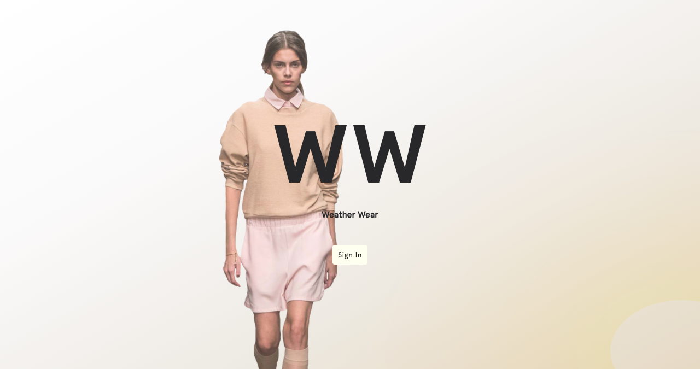

# Weather Wear Clothes

A Minimalist's Web application that takes the effort out of deciding what to wear each day by algorthimicaly deciding an outfit according to the weather & context

## Table Of Contents
- [User Story](#User-Story)
- [Technology](#Technology)
- [Link to depolyed app](#Link-to-depolyed-app)

## User Story
```
As a minimalist
I want to be able to upload and edit details of my wardobe and location
And have them tied to the weather and occasion 
So that I can look in the app and provided my outfit each day
```

## Technology

Front end
* HTML5
* CSS3
* Javascript
* JSX
* Bootstrap
* React
* React Slick
* Material UI

Back end
* Firebase
* Openweathermap API
* Moment.JS
* Anime.JS


# Link To Deployed App

https://weatherwearclothes.com
